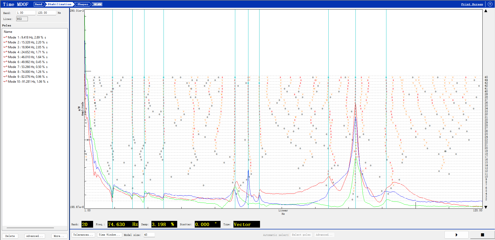

最近有幸参与了一项地面模态试验。供应商使用汉航的 NTS.Lab 采集和分析软件进行采集和模态识别。因故未能拿到授权，笔者基于其导出的 .unv 文件在 Testlab 中进行分析。

<!-- more -->

# 数据导入
为进行模态识别，需要 FRF 数据和几何数据。NTS.Lab 导出含 FRF、AutoPower、Coherence 的 uff 文件和含几何的 uff 文件。Testlab 勾选 Geometry 和 Modal Analysis 这两个 plug-in。

对于含有 FRF 等采集数据的 uff 文件，有两种处理方法。一种是转换成 Testlab Project，然后 展开到 session，Activate 为 Active session 或直接打开，效果相同；另一种是 Add to Input busket。后者存在一定的局限性。之后会讲到。

对于含有几何的 uff 文件，在 Geometry Workbook 中找到 uff 文件，展开到 Geometry 一层，选中其中的 Geometry 并点击“Import Geometry”。此时对话框提示“New geometry information will replace the current geometry. Are you sure you want to continue”，说明选中的是可以导入的 Geometry。点击 yes 确认。这时切换到 Geometry - Nodes，看到 Nodes 坐标列表，说明几何已经导入。

# 数据检查 —— FRF、Coherence
回到 Navigator Workbook 界面。

{width=1200px}

这里我们“Create Picture”，至少选 1x2，并选择一个 Node 的 FRF 和 Coherence 曲线查看。选择 4x2 可以一次对比 4 个 node 的数据。可以看到这次数据质量不太理想，Node 1~4 在高于 75Hz 的频段全军覆没。Node 2,3 在 46.1Hz~46.5Hz 的峰处表现还不错。44Hz 以下 Node2,4 在共振峰表现比较好。Node 5~8 在整个频域都很难看。（这里双击x坐标下面的区域，可以唤出频带宽度修改界面。）这说明 Node 1, 5~8 都没有很好地激振起来。

{width=1200px}

# Modal Data Selection
这里出现了第一个坑。在 Modal Data Selection Workbook 中，如果勾选 Display - Show points on geometry，会发现 FRF 对应的 node 并没有高亮。如果此时不做处理，做到 Time MDOF - Shape 时，会发现模态振型不显示，并且底部 annotation 提示“No matching nodes found”。这是因为数据 .unv 文件转换出的 session 中的 point ID 和几何 .unv 文件导入的 geometry 中的并不相同，需要使用 alias table 手动建立关联。

切换到 Navigator 或 Geometry workbook，右击当前 project，左击“Add/Edit Alias Mapping”。我们把“Alias Source Data”改成“Active Project Geometry”，然后根据使用的传感器类型，勾选平动自由度“+X,+Y,…,-Z”；把“Original Source Data”改为“Active Project Data”。Replace 之后，可见右侧是采集的通道，左侧是几何节点拥有的所有自由度。好在 point ID 的数字部分是相同的，因此肉眼可以看出对应关系。

两边的 list 支持 Ctrl 和 Shift 多选和连选。可以用“Quick Find”来筛选两边的自由度，就可以方便地连选了。

注意右侧会出现激励的数据，比如 1:2+Z 只有 AutoPower，并且在 FRF、Coherence 中充当除数。这里我们就先只 map 响应的数据。

全部数据项都 map 之后，再来到 Modal Data Selection Workbook 中，Refresh function table，就可以在 3D 视图中看到 FRF 对应的几何 Node 了，mapping 成功应用。

Tips：“数据检查”阶段发现的数据质量较好的点，可选中并在 FRF set 功能中 Create New Set。在下一步 Time MDOF 方法模态识别时可以“Change Modal Data Selection”并选择此 Set.

# Time MDOF 方法模态识别
首先显示的是自由度列表和各自由度的 FRF。列表可以多选。我们选择 Node 2,3,4 （或者用上一个 tips 建立的 Set）。这里选择的 FRF 会成为下一步 Stabilization 的对象。之后在底部设置 Stablization 的频段。

Stabilization 图，笔者个人的选择依据有2点：一是随着拟合阶数增加但频率几乎不改变的 Stable 点；二是 FRF 有峰的位置。前者容易理解，后者主要在有 FRF 峰但是频率不够稳定的情况下防止漏掉某个 FRF 峰对应的模态。

（劣势1，input busket只能作为一个数据进行识别，不能用于计算MAC）

# 保存
（session是不保存input busket文件的。